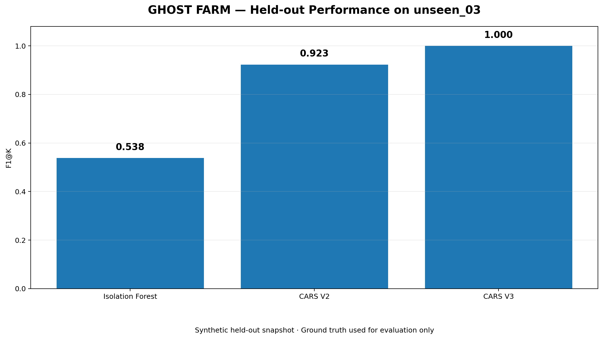

# GHOST FARM

> **정상처럼 보이는 계정들은 어디에서 들키는가**  
> 행동 동기화와 재화 유통망을 결합한 MMORPG 조직형 어뷰징 탐지 프로젝트

GHOST FARM은 플레이 가능한 합성 MMORPG 환경 **Aetheria : Moonberry Village**에서 행동·세션·거래 로그를 생성하고,  
개별 계정 이상치가 아니라 **Farm → Relay(Mule) → Hub로 이어지는 조직형 재화 흐름**을 탐지하는 포트폴리오 프로젝트입니다.

---

## 1. 핵심 질문

개별 계정만 보면 정상처럼 보이는 작업장 계정도  
여러 계정의 행동과 거래 관계를 함께 보면 조직 구조가 드러나는가?

이 프로젝트는 다음 실패 사례에서 출발했습니다.

- Hardcore 정상 유저는 활동량과 거래량이 커서 단일 계정 이상탐지에서 자주 오탐됨
- Guild 정상 유저는 Farm보다 행동 동기화가 더 높을 수 있음
- Farm은 개별 행동만 보면 정상 사용자처럼 보이도록 설계됨
- Mule 분산, 정상 거래 섞기, 소액 분할 송금으로 단순 규칙을 회피할 수 있음
- Hub는 플레이 행동이 적어 일반 계정 점수 합산에서 과소평가되기 쉬움

---

## 2. Key Results



| 모델 | Precision@K | Recall@K | F1@K |
|---|---:|---:|---:|
| Isolation Forest | 0.538 | 0.538 | 0.538 |
| CARS V2 | 0.923 | 0.923 | 0.923 |
| **CARS V3** | **1.000** | **1.000** | **1.000** |

> 신규 synthetic held-out snapshot `unseen_03`에서 CARS V3는 Precision@K, Recall@K, F1@K = **1.000**을 기록했습니다.  
> 이 결과는 합성 환경에서의 실험 결과이며 실제 게임 서비스에서의 100% 정확도를 의미하지 않습니다.

---

## 3. 프로젝트 구성

```text
GHOST-FRAM/
├─ game/                         # Aetheria 브라우저 게임 및 로그 생성기
├─ src/
│  ├─ inspect_logs.py
│  ├─ eda_baseline_v2.py
│  ├─ transaction_network.py
│  ├─ behavior_sync.py
│  ├─ cars_v1.py
│  ├─ cars_v2.py
│  ├─ cars_v3.py
│  ├─ run_unseen_validation_v2.py
│  ├─ run_unseen_validation_v3.py
│  ├─ red_team_generate.py
│  ├─ red_team_batch_validate.py
│  └─ red_team_batch_validate_v3.py
├─ data/
│  ├─ raw/
│  ├─ processed/
│  ├─ analysis/
│  ├─ unseen/
│  ├─ redteam/
│  ├─ redteam_v3/
│  └─ validation/
├─ docs/
│  ├─ log-schema.md
│  ├─ synthetic-users.md
│  ├─ verification.md
│  ├─ performance_comparison.png
│  └─ organization_flow.png
├─ server.cjs
├─ start-game.cmd
└─ README.md
```

---

## 4. Aetheria : Moonberry Village

Aetheria는 이상탐지 실험용 합성 로그를 만들기 위한 브라우저 RPG입니다.

플레이어와 36명의 합성 주민이 같은 월드에서 다음 행동을 수행합니다.

- 이동 / 휴식
- 채집
- 전투
- 퀘스트
- 상점 판매
- 유저 간 골드 거래
- 마켓 거래
- 로그인 / 로그아웃

합성 주민은 7개 유형으로 구성됩니다.

| 유형 | 수 | 의도 |
|---|---:|---|
| Normal | 10 | 일반 사용자 |
| Hardcore | 4 | 활동량과 거래량이 큰 정상 사용자 |
| Guild | 6 | 강하게 동기화된 정상 협동 사용자 |
| Bot | 3 | 반복 행동 중심 자동화 계정 |
| Farm | 10 | 개별 행동은 정상처럼 보이지만 재화를 Relay로 전달 |
| Mule | 2 | 여러 Farm의 재화를 받아 Hub로 중계 |
| Hub | 1 | 최종 재화 집결 계정 |

자세한 설계는 [합성 사용자 유형](docs/synthetic-users.md)을 참고하세요.

---

## 5. 실행 방법

### Windows

프로젝트 루트에서:

```powershell
.\start-game.cmd
```

또는:

```powershell
node server.cjs
```

브라우저에서:

```text
http://127.0.0.1:4173
```

### 기본 조작

- `WASD` / 방향키: 이동
- `Shift`: 대시
- `E`: 상호작용 / 채집
- `Space`: 공격

게임 내 운영자 기능에서 Events / Transactions / Sessions / 전체 JSON을 Export할 수 있습니다.

---

## 6. 로그 구조

주요 Event 필드:

```text
event_id
timestamp
user_id
character_id
session_id
action_type
map_id
x
y
target_user_id
item_id
quantity
gold_delta
metadata
```

Transaction 주요 필드:

```text
transaction_id
timestamp
sender_id
receiver_id
gold_amount
item_id
quantity
market_price
trade_price
transaction_type
metadata
```

Ground Truth는 모델 점수 계산에 사용하지 않고 **평가 단계에서만** 사용합니다.

전체 스키마: [로그 스키마](docs/log-schema.md)

---

## 7. 분석 파이프라인

```text
Aetheria Log
    ↓
Feature Inspection
    ↓
Isolation Forest Baseline
    ↓
Transaction Network
    ↓
Behavior Synchronization
    ↓
CARS V2
    ↓
Red-Team Failure Analysis
    ↓
CARS V3 Organization Flow Detector
```

### Baseline

개별 계정 단위 특징에 Isolation Forest를 적용했습니다.

문제는 Hardcore 정상 사용자가 작업장처럼 보이고,  
Farm은 개별적으로는 정상에 가까워 조직형 탐지 성능이 낮다는 점이었습니다.

### Behavior Synchronization

행동 프로필, 시간대별 행동, 맵 이동, 로그인 시차를 결합해 SyncScore를 계산했습니다.

중요한 반례:

> Guild의 행동 동기화가 Farm보다 높게 나타날 수 있다.

따라서 **높은 Sync만으로 작업장을 판정하지 않고 재화 Funnel과 결합**했습니다.

---

## 8. CARS V2

CARS V2는 다음 구조를 결합합니다.

- Farm purity
- Mule purity
- Hub purity
- Ghost Chain
- Economic anomaly
- Repetition
- 구조적 Funnel이 있을 때만 Sync interaction 반영

Held-out `unseen_02` 결과:

| 모델 | Precision@K | Recall@K | F1@K |
|---|---:|---:|---:|
| Isolation Forest | 0.538 | 0.538 | 0.538 |
| CARS V2 | **0.923** | **0.923** | **0.923** |

하지만 Red-Team에서 약점이 드러났습니다.

| 공격 | CARS V2 F1@K |
|---|---:|
| Time jitter | 0.923 |
| Mule split | 0.769 |
| Micro transaction | 0.923 |
| Normal mix | 0.846 |
| Behavior noise | 0.923 |
| Composite | 0.692 |

핵심 실패 원인:

1. Farm이 여러 Mule로 송금을 분산하면 primary receiver share가 약해짐
2. Hub가 반복적으로 False Negative가 됨
3. 정상 거래를 섞을수록 계정 단위 위험 점수 경계가 흐려짐

---

## 9. CARS V3 — Organization Flow Detector

V3는 계정 하나가 아니라 **조직 전체의 자금 유통 구조**를 탐지하도록 변경했습니다.


### 핵심 변경

1. 단일 Primary Receiver 대신 **Relay Set 전체로 흐른 비율** 계산
2. `Source → Relay → Collector` 구조를 graph message passing 방식으로 전파
3. Hub/Collector branch를 별도로 유지해 다른 계정 점수에 희석되지 않도록 처리
4. 기존 Account Risk와 Organization Support를 결합

개념적으로:

```text
Farm A ─┐
Farm B ─┼→ Mule 1 ─┐
Farm C ─┘           │
                    ├→ Hub
Farm D ─┐           │
Farm E ─┼→ Mule 2 ─┘
Farm F ─┘
```

공격자가 Mule을 여러 개로 나누더라도  
Relay 집합 전체와 최종 Collector 수렴 구조를 함께 평가합니다.

---

## 10. 최종 Held-out 검증

새로 생성한 `unseen_03`은 V3 개발 이후 **코드 수정 없이** 평가했습니다.

데이터 규모:

- Events: 13,820
- Transactions: 1,002
- Sessions: 448
- Synthetic Ground Truth accounts: 36

결과:

| 모델 | Precision@K | Recall@K | F1@K |
|---|---:|---:|---:|
| Isolation Forest | 0.538 | 0.538 | 0.538 |
| CARS V2 | 0.923 | 0.923 | 0.923 |
| **CARS V3** | **1.000** | **1.000** | **1.000** |

CARS V3:

```text
TP = 13
FP = 0
FN = 0
TN = 20
```

탐지:

```text
Farm = 10 / 10
Mule = 2 / 2
Hub  = 1 / 1
```

---

## 11. V3 Red-Team 검증

`unseen_03`을 기반으로 6종 회피 시나리오를 다시 생성했습니다.

| 공격 | V3 F1@K | V2 F1@K | Baseline F1@K |
|---|---:|---:|---:|
| Time jitter | **1.000** | 0.923 | 0.538 |
| Mule split | **1.000** | 0.846 | 0.538 |
| Micro transaction | **1.000** | 0.923 | 0.538 |
| Normal mix | **1.000** | 0.923 | 0.538 |
| Behavior noise | **1.000** | 0.923 | 0.538 |
| Composite | **1.000** | 0.846 | 0.538 |

모든 시나리오에서:

```text
TP = 13
FP = 0
FN = 0
TN = 20
```

단, 이 결과는 **synthetic environment에서 정의한 공격군에 대한 실험 결과**입니다.  
실제 서비스 데이터에서의 100% 정확도나 완전히 미지의 공격 유형에 대한 일반화를 의미하지 않습니다.

자세한 검증 과정: [검증 보고서](docs/verification.md)

---

## 12. 왜 단순 이상탐지보다 조직 구조가 중요했는가

이 프로젝트에서 가장 중요한 결론은:

> **개별 계정에는 이상이 없었다. 그런데 여러 계정을 함께 보자, 돈은 한 곳으로 흐르고 있었다.**

Hardcore 사용자의 거래량은 높을 수 있고, Guild 사용자는 매우 동기화될 수 있습니다.

따라서 실무형 조직 탐지에서는 단일 임계값보다:

- 관계 구조
- 재화 집중도
- Relay 역할
- Multi-hop flow
- Counter-evidence
- 시간적 패턴

을 함께 보는 것이 중요합니다.

---

## 13. 재현 가능한 주요 명령

### unseen 검증

```powershell
.\.venv\Scripts\python.exe .\src\run_unseen_validation_v3.py `
  --input ".\data\unseen\aetheria-unseen-03.json" `
  --label "unseen_03"
```

### Red-Team 데이터 생성

```powershell
.\.venv\Scripts\python.exe .\src\red_team_generate.py `
  --input ".\data\unseen\aetheria-unseen-03.json" `
  --outdir ".\data\redteam_v3" `
  --scenario all
```

### V3 Red-Team 배치 검증

```powershell
$env:OPENBLAS_NUM_THREADS="1"
$env:OMP_NUM_THREADS="1"
$env:MKL_NUM_THREADS="1"
$env:NUMEXPR_NUM_THREADS="1"

.\.venv\Scripts\python.exe .\src\red_team_batch_validate_v3.py `
  --indir ".\data\redteam_v3"
```

---

## 14. 문서

- [로그 스키마](docs/log-schema.md)
- [합성 사용자 유형](docs/synthetic-users.md)
- [검증 보고서](docs/verification.md)

---

## 15. 한계

- 모든 데이터는 합성 데이터이며 실제 게임 서비스 사용자를 나타내지 않습니다.
- Ground Truth는 평가용으로만 사용하지만, synthetic behavior generator 자체는 역할별 정책을 알고 있습니다.
- `unseen_03` 기반 Red-Team은 새로운 스냅샷이지만 공격 종류 자체는 V2 실패 분석에서 이미 정의한 공격군입니다.
- 따라서 V3의 결과는 **정의된 synthetic threat model 안에서의 강건성 검증**으로 해석해야 합니다.
- 현재 핵심 평가는 `Precision@K / Recall@K / F1@K` 기반이며, 실제 운영 환경에서는 별도의 threshold calibration과 review budget 설계가 필요합니다.
- 실제 운영 환경에서는 데이터 드리프트, 신규 공격 유형, 계정 공유, 디바이스/IP 관계, 결제·제재 이력 등을 추가 검토해야 합니다.

---

## 16. 프로젝트 한 줄 요약

**개별 이상치 탐지에서 실패한 문제를 거래 그래프와 조직 단위 재화 흐름으로 재정의하고, held-out + red-team 검증까지 수행한 MMORPG 조직형 어뷰징 탐지 프로젝트.**
