# GHOST FARM Architecture

> **Aetheria에서 실제 로그를 만들고, 그 로그가 어떻게 CARS V3까지 흘러가는지 보여주는 시스템 아키텍처 문서입니다.**

<p align="center">
  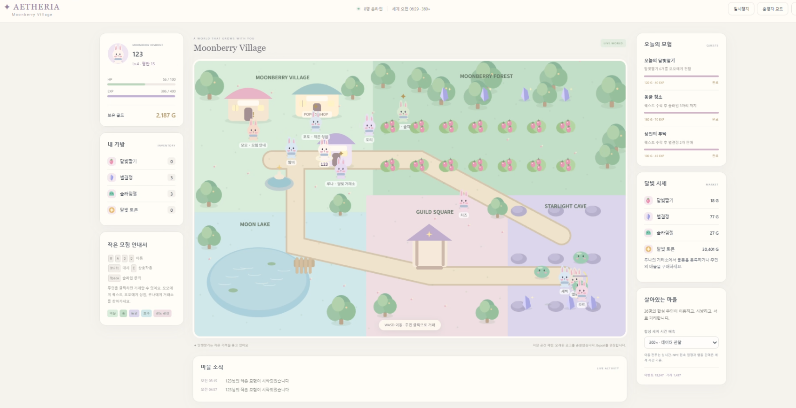
</p>

---

## 1. End-to-End Architecture

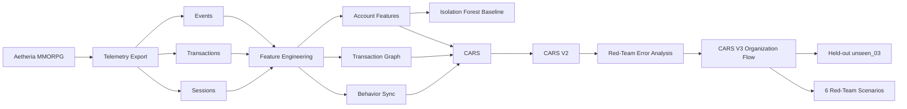

이 프로젝트의 핵심은 **분석용 CSV를 임의로 만든 것이 아니라, 플레이 가능한 게임 환경에서 로그가 실제로 발생하도록 구현했다는 점**입니다.

---

## 2. Game Layer — 로그가 만들어지는 곳

<table>
<tr>
<td width="50%">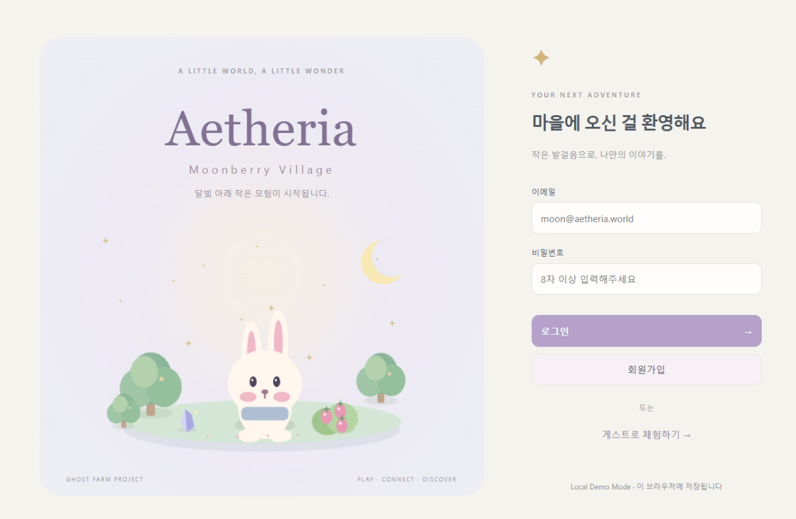<br><b>Login</b></td>
<td width="50%">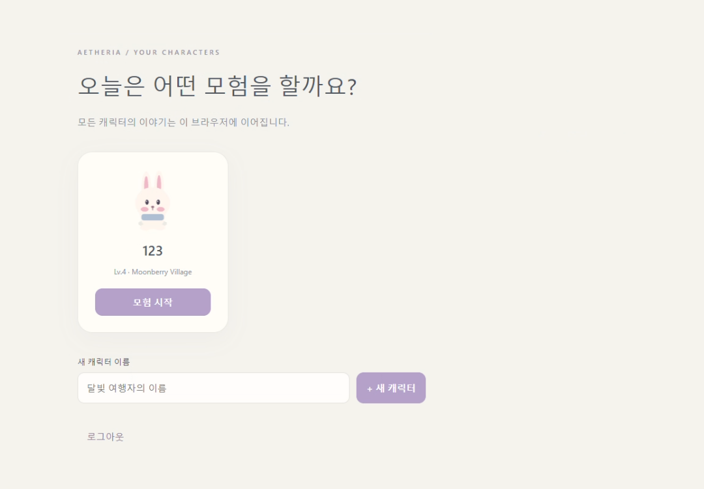<br><b>Character Select</b></td>
</tr>
</table>

<p align="center">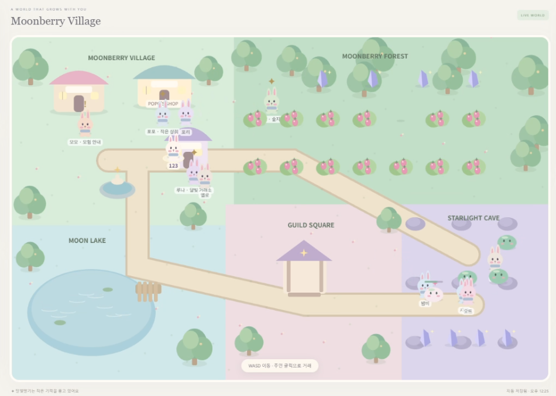</p>

Aetheria에는 플레이어 외에 **36명의 합성 주민**이 존재합니다.

- Normal 10
- Hardcore 4
- Guild 6
- Bot 3
- Farm 10
- Mule 2
- Hub 1

이들은 이동, 전투, 채집, 상점 판매, 유저 간 거래, 마켓 거래, 로그인/로그아웃을 수행합니다.

---

## 3. Observability Layer — 게임 내부 운영자 도구

<p align="center">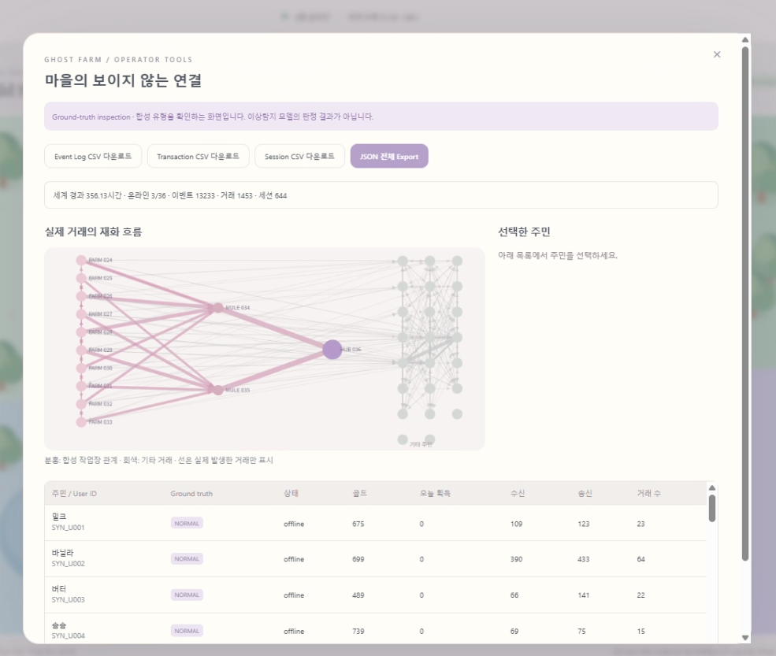</p>

운영자 화면은 단순 디버그 페이지가 아니라 **synthetic world에서 어떤 계정 간 재화 이동이 발생했는지 검수하는 관찰 도구**입니다.

여기서 확인 가능한 정보:

- 실제 발생한 거래 네트워크
- Farm → Mule → Hub 흐름
- 계정별 Ground Truth 역할(검수용)
- 송신/수신 골드
- 거래 수
- Event / Transaction / Session CSV Export
- Full JSON Export

> Ground Truth는 **모델 점수 계산에는 사용하지 않고 평가 단계에서만 사용**합니다.

---

## 4. Raw Data Layer

<table>
<tr>
<td width="50%">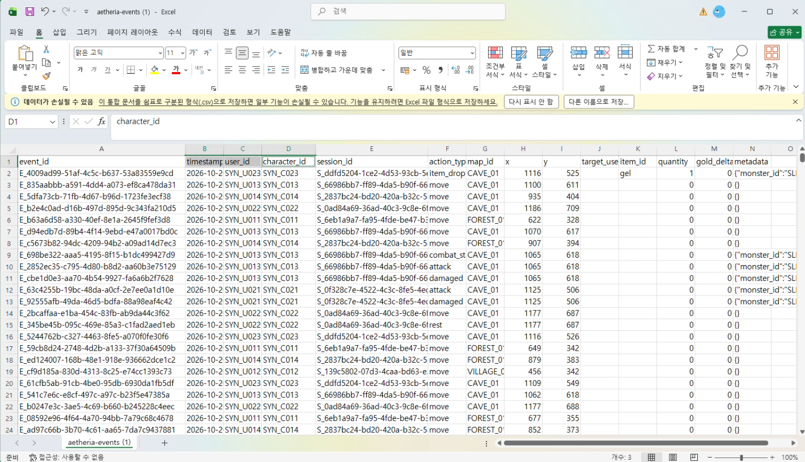<br><b>Events</b> — 행동·위치·전투·아이템</td>
<td width="50%">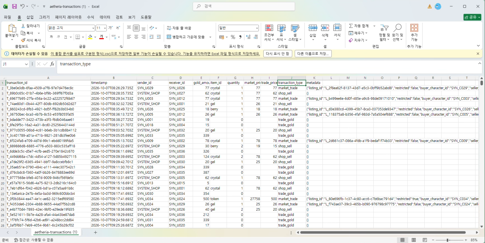<br><b>Transactions</b> — sender/receiver/재화/가격</td>
</tr>
<tr>
<td width="50%">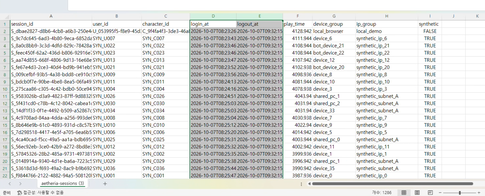<br><b>Sessions</b> — 접속·플레이 시간·device/IP group</td>
<td width="50%">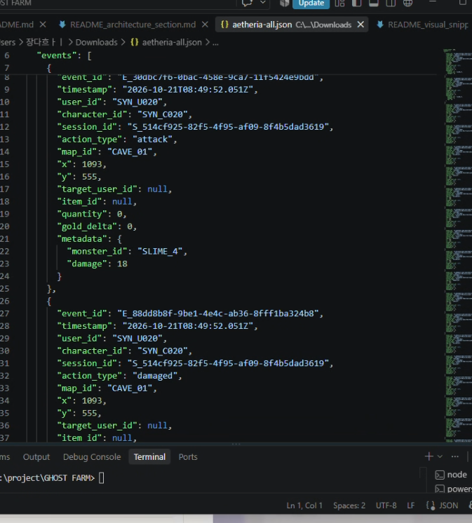<br><b>Snapshot JSON</b> — 전체 월드 상태 및 Ground Truth</td>
</tr>
</table>

---

## 5. Feature Layer

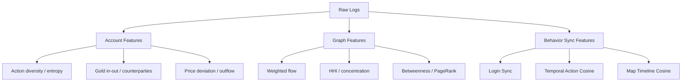

### Account
- event count
- action diversity
- action entropy
- map diversity
- gold sent / received
- unique sender / receiver
- max receiver share
- outflow ratio

### Graph
- weighted in / out
- in/out degree
- HHI
- flow balance
- betweenness
- PageRank

### Behavior Sync
- login sync
- action-profile cosine
- temporal-action cosine
- map-timeline cosine

---

## 6. Detection Layer

### Baseline

Isolation Forest는 **계정 하나의 feature**에서 이상치를 찾습니다.

문제:
- Hardcore 정상 사용자를 오탐할 수 있음
- 정상 행동을 섞은 Farm을 놓칠 수 있음
- 조직 구조를 직접 표현하지 못함

### CARS V2

계정 Risk + 거래 구조 + Sync를 결합했습니다.

하지만 Red-Team에서:
- Mule Split
- Normal Mix
- Composite
- Hub False Negative

문제가 드러났습니다.

### CARS V3

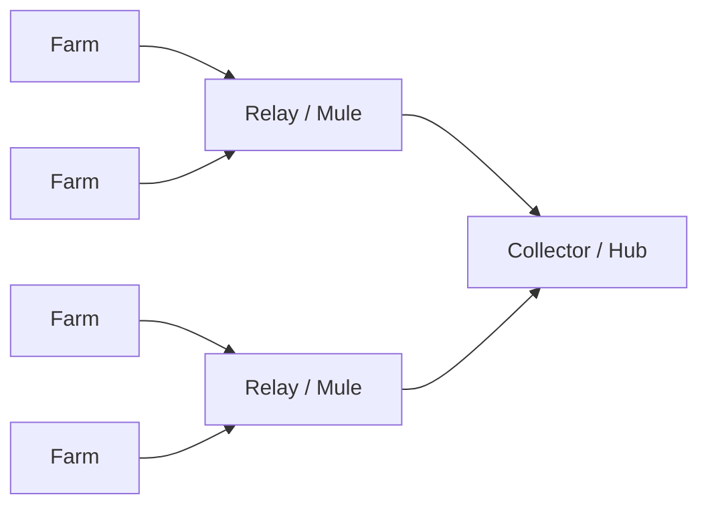

V3는 **single primary receiver**가 아니라 **Relay Set 전체**와 `Source → Relay → Collector` multi-hop 구조를 평가합니다.

---

## 7. Evaluation Layer

<p align="center"></p>

| 모델 | Precision@K | Recall@K | F1@K |
|---|---:|---:|---:|
| Isolation Forest | 0.538 | 0.538 | 0.538 |
| CARS V2 | 0.923 | 0.923 | 0.923 |
| **CARS V3** | **1.000** | **1.000** | **1.000** |

`unseen_03`은 V3 설계 이후 새로 생성한 synthetic held-out snapshot입니다.

CARS V3 결과:

```text
TP = 13
FP = 0
FN = 0
TN = 20

Farm = 10 / 10
Mule = 2 / 2
Hub  = 1 / 1
```

---

## 8. 운영 관점

탐지 결과는 자동 Ban보다는 다음 흐름을 가정합니다.

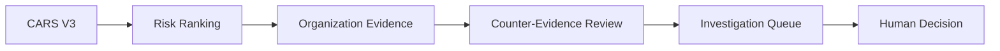

즉, **높은 활동량이나 높은 Sync만으로 제재하지 않고 조직 구조와 반대 근거를 함께 확인**합니다.

---

## 9. 한계

- synthetic data 기반
- simulator distribution 내부 held-out
- predefined red-team attack family
- 현재 핵심 평가는 `Precision@K / Recall@K / F1@K`
- production threshold / review budget은 별도 설계 필요

따라서 이 결과는 실제 서비스의 100% 탐지를 의미하지 않습니다.
