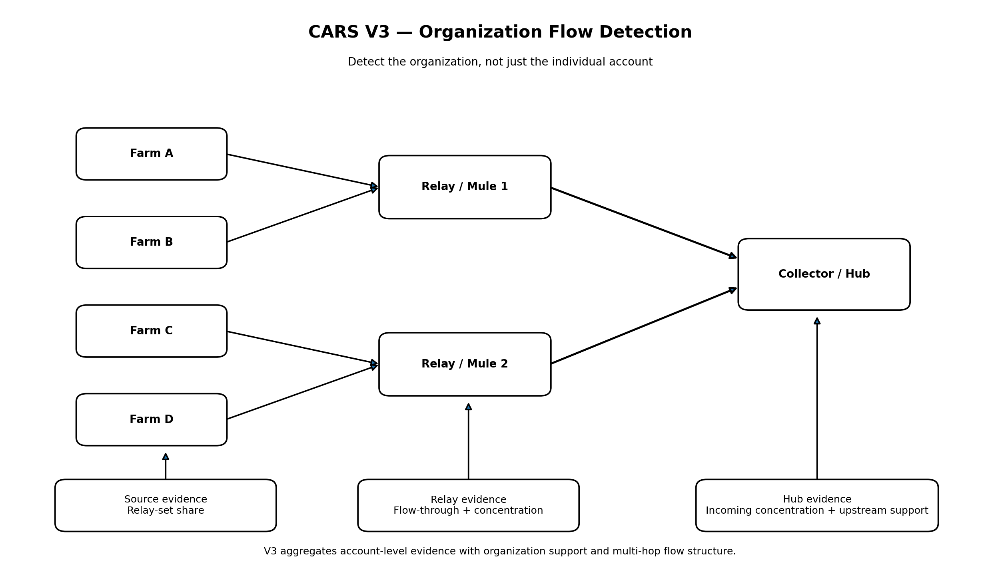

# GHOST FARM Detection Specification

> 실제 Aetheria 로그가 어떤 feature로 바뀌고, CARS V3가 어떤 구조를 탐지하는지 정리한 명세입니다.

<p align="center"></p>

---

## 1. Input

### Event
<p align="center"></p>

주요 필드:
`timestamp`, `user_id`, `session_id`, `action_type`, `map_id`, `x`, `y`, `target_user_id`, `gold_delta`

### Transaction
<p align="center"></p>

주요 필드:
`timestamp`, `sender_id`, `receiver_id`, `gold_amount`, `market_price`, `trade_price`, `transaction_type`

### Session
<p align="center"></p>

주요 필드:
`user_id`, `login_at`, `logout_at`, `play_time`, `device_group`, `ip_group`

---

## 2. Detection Target

```text
Farm → Mule → Hub
```

organized abuse 평가의 positive:
- Farm
- Mule
- Hub

Bot은 반복 이상 유형이지만 조직형 재화 흐름 평가와는 별도로 봅니다.

---

## 3. Core Features

### Account-level
- event_count
- action_diversity
- map_diversity
- action_entropy
- gold_sent / gold_received
- unique_senders / unique_receivers
- max_receiver_share
- outflow_ratio
- price_deviation

### Graph-level
- weighted_in / weighted_out
- in_degree / out_degree
- in_hhi / out_hhi
- flow_balance
- betweenness
- pagerank

### Synchronization
- LoginSync
- ActionProfileCosine
- TemporalActionCosine
- MapTimelineCosine

> 실험에서 Guild Sync가 Farm보다 높을 수 있었기 때문에 **High Sync = Abuse** 규칙은 사용하지 않습니다.

---

## 4. CARS V2 Failure

### Hardcore FP
높은 활동량과 높은 거래량 때문에 이상 계정처럼 보일 수 있으나 거래 상대가 넓고 flow가 balanced합니다.

### Farm FN
정상 거래를 섞어 단일 receiver 집중도를 낮출 수 있습니다.

### Hub FN
행동량이 적어 일반 account score aggregation에서 과소평가될 수 있습니다.

### Mule Split
여러 Mule로 나누면 primary receiver share가 감소합니다.

---

## 5. CARS V3

<p align="center"></p>

V3 핵심:

1. **Relay Set Share** — 단일 receiver가 아닌 relay 집합 전체 비중
2. **Source Component** — 재화를 relay 방향으로 지속 전달하는가
3. **Relay Component** — 여러 source의 재화를 받아 소수 collector로 전달하는가
4. **Collector Component** — relay의 재화가 최종적으로 수렴하는가
5. **Organization Support** — 연결된 계정 간 구조적 지지
6. **Independent Hub Branch** — Hub risk가 다른 계정 score에 희석되지 않도록 별도 유지

개념:

```text
relay_set_share = gold_sent_to_relays / total_gold_sent
```

---

## 6. Evaluation

`unseen_03` held-out:

| 모델 | F1@K |
|---|---:|
| Isolation Forest | 0.538 |
| CARS V2 | 0.923 |
| CARS V3 | **1.000** |

6종 red-team:
- time_jitter
- mule_split
- micro_tx
- normal_mix
- behavior_noise
- composite

CARS V3는 위 predefined six scenarios에서 F1@K 1.000을 유지했습니다.

---

## 7. Decision Policy

```text
CARS V3
  ↓
Risk Ranking
  ↓
Organization Evidence
  ↓
Counter-Evidence
  ↓
Investigation Queue
  ↓
Human Review
```

자동 제재 엔진이 아니라 **조사 우선순위 시스템**으로 해석합니다.

---

## 8. Limitations

- synthetic environment
- predefined attack families
- small synthetic population
- `@K` ranking evaluation
- production threshold 미적용
- real payment/device/social graph 미포함
